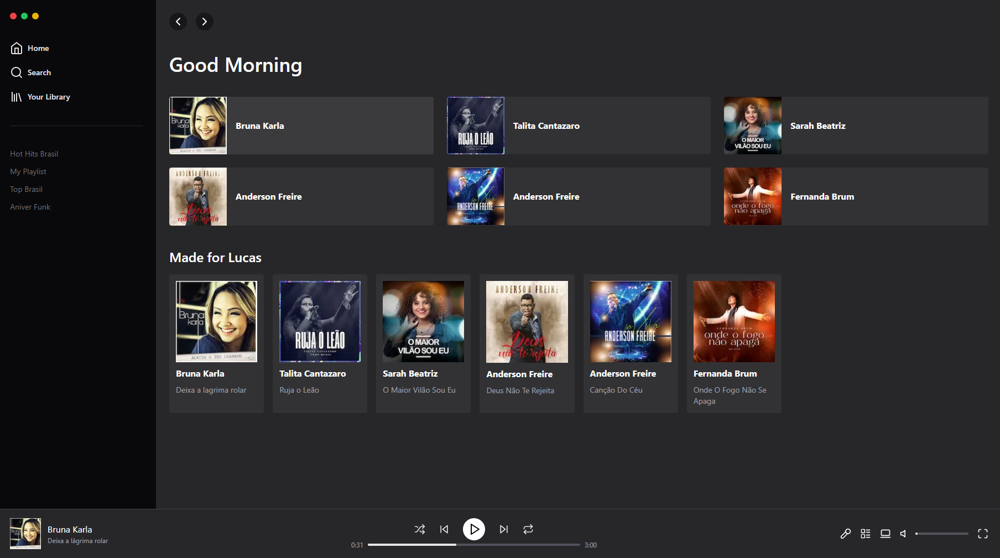

<h1 align="center"> Mini Spotify </h1>

Feito para estudo do tailwindcss e next  

  <a href="#-tecnologias">Tecnologias</a>&nbsp;&nbsp;&nbsp;|&nbsp;&nbsp;&nbsp;
  <a href="#-projeto">Projeto</a>&nbsp;&nbsp;&nbsp;|&nbsp;&nbsp;&nbsp;
  <a href="#memo-licença">Licença</a>

  

 

  

## 🚀 Tecnologias

Esse projeto foi desenvolvido com as seguintes tecnologias:

- TailwindCSS
- Typescript
- NextJS
- Git e Github

## 💻 Projeto

O Spotify é uma plataformas para se escutar músicas.

## :memo: Licença

Esse projeto está sob a licença MIT.

---

Feito com ♥ by Lucas :wave:
